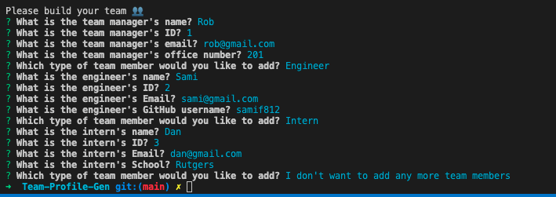
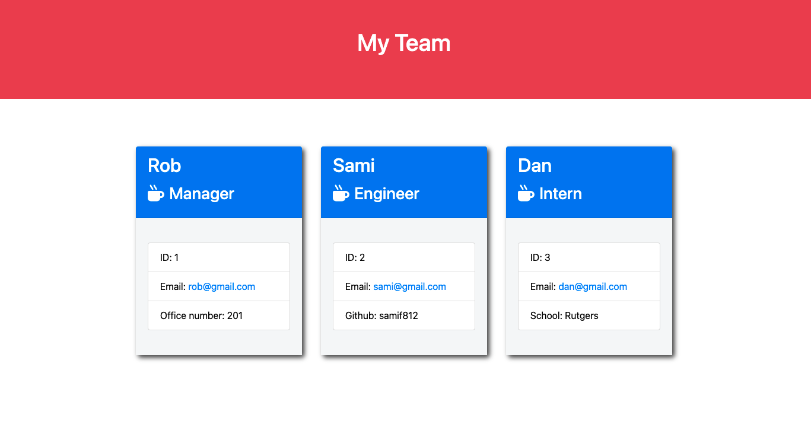

# Team-Profile-Gen

## Links
Github Repo: https://github.com/SamiF812/Team-Profile-Gen

Demo Link: https://youtu.be/rLnT85mmn9M

## Screenshots 

## Description

Created a command line application that allows the user to input and generate a team roster. The info provided will generate onto an HTML and be viewable once the user selects that they are done adding team members. This is a quick and effiecent way to create and display a team's roster in an HTML.